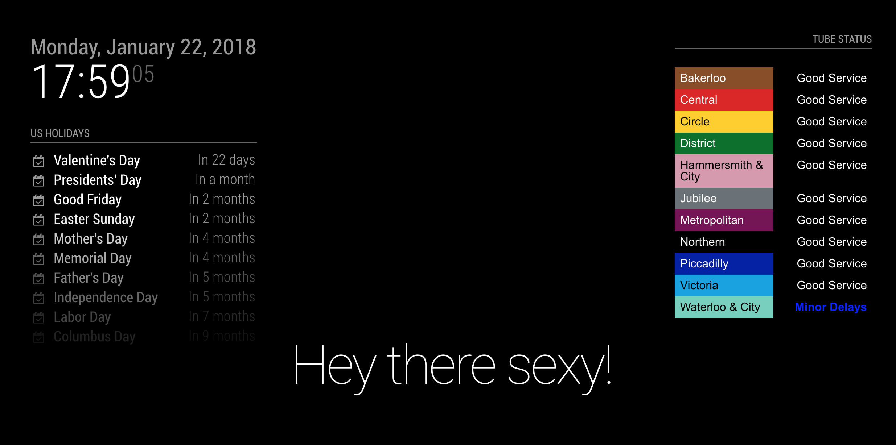

# MMM-TFL

MagicMirror module for Transport For London tube line status designed to replicate the [TFL status board](https://tfl.gov.uk/tube-dlr-overground/status/).

## Preview



## Installation

1. Navigate into your MagicMirror's `modules` folder and execute `git clone https://github.com/SilverBirchh/MMM-TFL.git`.

2. `cd MMM-TFL` and execute `npm install`.

3. Add this module to your `config.js` file.

## Updating

1. In a terminal navigate into your MagicMirror's `modules` folder `cd MMM-TFL` and execute `git pull`.

## Config

To use this module, add it to the modules array in the `config/config.js` file:

```javascript
modules: [
    {
    module: 'MMM-TFL',
    position: 'top_right',    // This can be any of the regions but works best on either side of the display
    config: {
          updateTime: 60000,
                    modes: ['tube', 'overground'],
          lines: 'all'
    }
    }
]
```

Option       | Description
------------ | ----------------------------------------------------------------------------------------------------------------------------------------------------------------------------------------------------------------------------------------------------------------------------------------------------------
`updateTime` | Number. Optional. The interval time in seconds to update the status of the tube line. Defaults to `60000` (10 minutes)
`modes`      | Array. Optional. The lines displayed can be refined by a mode if you only want to view lines in a specific mode. Saves having to add quite a few lines to the `lines` array. Defaults to `['tube', 'overground']`
`lines`      | Array / String. Optional. The tube lines you want to keep track of. Can be an array of line id's e.g. If you specify a line but not the mode it is contained in, the line will not be included on the board. `['central', 'bakerloo', 'circle']` or `all` which will display all lines. Defaults to `all`.

## Lines

Id                         | Line                       | Mode
-------------------------- | -------------------------- | -------------
bakerloo                   | Bakerloo                   | tube
central                    | Central                    | tube
circle                     | Circle                     | tube
district                   | District                   | tube
hammersmith-city           | Hammersmith & City         | tube
jubilee                    | Jubilee                    | tube
metropolitan               | Metropolitan               | tube
northern                   | Northern                   | tube
piccadilly                 | Piccadilly                 | tube
victoria                   | Victoria                   | tube
waterloo-city              | Waterloo & City            | tube
dlr                        | DLR                        | dlr
london-overground          | London Overground          | overground
tram                       | Tram                       | tram
tfl-rail                   | TFL Rail                   | tflrail
arriva-trains-wales        | Arriva Trains Wales        | national-rail
c2c                        | c2c                        | national-rail
chiltern-railways          | Chiltern Railways          | national-rail
cross-country              | Cross Country              | national-rail
east-midlands-trains       | East Midlands Trains       | national-rail
first-hull-trains          | First Hull Trains          | national-rail
first-transpennine-express | First TransPennine Express | national-rail
gatwick-express            | Gatwick Express            | national-rail
grand-central              | Grand Central              | national-rail
greater-anglia             | Greater Anglia             | national-rail
great-northern             | Great Northern             | national-rail
great-western-railway      | Great Western Railway      | national-rail
heathrow-connect           | Heathrow Connect           | national-rail
heathrow-express           | Heathrow Express           | national-rail
island-line                | Island Line                | national-rail
merseyrail                 | Merseyrail                 | national-rail
northern-rail              | Northern Rail              | national-rail
scotrail                   | ScotRail                   | national-rail
southeastern               | Southeastern               | national-rail
southern                   | Southern                   | national-rail
south-western-railway      | South Western Railway      | national-rail
thameslink                 | Thameslink                 | national-rail
virgin-trains              | Virgin Trains              | national-rail
virgin-trains-east-coast   | Virgin Trains East Coast   | national-rail
west-midlands-trains       | West Midlands Trains       | national-rail

## Anything else you need to know?

Nope. The TFL API is free to use and does not require an API key. This project does not use any external dependencies. Any improvements please feel free to submit a PR.

## To Do

[ ] - Add bus status<br>
[ ] - Add alerts at certain times<br>
[ ] - Testing

## Special Thanks

- [Michael Teeuw](https://github.com/MichMich) for creating the awesome [MagicMirror2](https://github.com/MichMich/MagicMirror/tree/develop) project that made this module possible.
